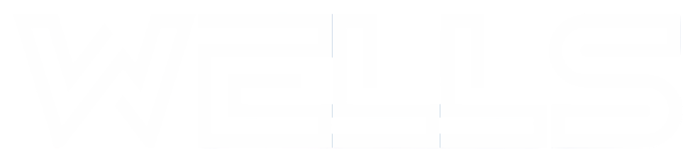

<h1 align="center">WellsRPC</h1>

  
  
  
  
   
  
  
  
  

  <strong>WellsRPC</strong> is a lightweight high-performance RPC and binary serialization library for Go,  
  designed for microservices, IoT, Kafka messaging, and cross-language communication.

  

<h2>📌 Table of Contents</h2>
<ul>
  <li><a href="#about-the-project">About The Project</a></li>
  <li><a href="#features">Features</a></li>
  <li><a href="#project-structure">Project Structure</a></li>
  <li><a href="#installation">Installation</a></li>
  <li><a href="#usage">Usage</a></li>
  <li><a href="#interceptors">Interceptors</a></li>
  <li><a href="#idempotency">Idempotency</a></li>
  <li><a href="#idl-and-code-generation">IDL & Code Generation</a></li>
  <li><a href="#example-producer-and-consumer">Example Producer & Consumer</a></li>
  <li><a href="#workflow-diagram">Workflow Diagram</a></li>
  <li><a href="#benchmark">Benchmark</a></li>
  <li><a href="#testing">Testing</a></li>
  <li><a href="#production-readiness">Production Readiness</a></li>
  <li><a href="#development-workflow">Development Workflow</a></li>
  <li><a href="#contributing">Contributing</a></li>
  <li><a href="#license">License</a></li>
</ul>

<h2 id="about-the-project">ℹ️ About The Project</h2>

  <strong>WellsRPC</strong> is a high-performance Go library providing:

<ul>
  <li>Binary serialization with <b>ultra-fast marshalling/unmarshalling</b></li>
  <li>Lightweight RPC framework with streaming and unary calls</li>
  <li>IDL-based code generation for Go structs and RPC stubs</li>
  <li>Support for IoT, Kafka, and microservice messaging</li>
</ul>

It is optimized for <b>speed, low memory footprint, and minimal dependencies</b>.

  Beyond a traditional RPC framework, <strong>WellsRPC</strong> is designed with
  <b>enterprise and financial-grade guarantees</b> in mind:

<ul>
  <li>Frame-based metadata propagation (trace-id, deadline, idempotency-key)</li>
  <li>Built-in idempotency for retry-safe operations</li>
  <li>Client & server interceptors</li>
  <li>Semantic RPC errors (retryable vs non-retryable)</li>
</ul>

<h2 id="features">🚀 Features</h2>
<ul>
  <li>Marshal/Unmarshal structs to binary efficiently</li>
  <li>Buffer pool to reduce GC pressure</li>
  <li>IDL-driven code generation for Go RPC client/server</li>
  <li>Cross-language compatible (Go ↔ Java)</li>
  <li>Lightweight RPC client & server with streaming support</li>
  <li>TCP transport, with optional TLS (mTLS)</li>
  <li>Minimal dependencies</li>
  <li><b>Frame-based protocol</b> with extensible metadata</li>
  <li><b>Unary & streaming interceptors</b></li>
  <li><b>Idempotency support</b></li>
  <li><b>Deadline propagation</b></li>
  <li><b>Core-banking ready design</b></li>
</ul>

<h2 id="project-structure">🗂️ Project Structure</h2>
<pre>
wells-rpc/
├── pkg/wellsrpc/
│   ├── client.go
│   ├── server.go
│   ├── frame.go
│   ├── stream.go
│   ├── interceptor.go
│   ├── idempotency.go
│   ├── error.go
│   ├── pool.go
│   ├── encode.go
│   ├── varint.go
│   └── codec_generated/
│       └── *.wells.go
├── cmd/welli-codegen/
│   └── main.go
├── examples/
│   ├── producer/
│   ├── consumer/
│   └── sensor/
│       └── sensor.wb.idl
└── benchmark/
    └── main_test.go
</pre>

<h2 id="installation">🛠️ Installation</h2>

<h3>Prerequisites</h3>
<ul>
  <li>Go 1.18+</li>
  <li>Git</li>
</ul>

<pre><code>go get github.com/welliardiansyah/wells-rpc</code></pre>

<h2 id="usage">⚡ Usage</h2>

<h3>Encode & Decode Struct</h3>
<pre><code>s := &codec_generated.SensorReading{...}
data := s.MarshalWells()
_ = s.UnmarshalWells(data)</code></pre>

<h2 id="interceptors">🧩 Interceptors</h2>

Interceptors allow logging, tracing, auth, rate-limit, retries, and auditing
without touching business logic.

<pre><code>srv.UseUnaryInterceptor(func(ctx context.Context, f *wellsrpc.Frame, next func(context.Context,*wellsrpc.Frame)(*wellsrpc.Frame,error)) (*wellsrpc.Frame,error) {
  log.Println("method:", f.Method)
  return next(ctx, f)
})</code></pre>

<h2 id="idempotency">🔁 Idempotency</h2>

WellsRPC guarantees retry-safe execution using idempotency keys.

<pre><code>ctx := context.WithValue(context.Background(), "idempotency-key", "payment-001")
client.Call(ctx, "PaymentService.Transfer", req, resp)</code></pre>

<h2 id="benchmark">⚙️ Benchmark</h2>
<pre><code>go test ./benchmark -bench=. -benchmem</code></pre>

<h2 id="testing">🧪 Testing</h2>
<pre><code>go test ./...
go test -race ./...</code></pre>

<h2 id="production-readiness">🏦 Production Readiness</h2>
<ul>
  <li>Retry-safe idempotent calls</li>
  <li>Semantic error handling</li>
  <li>mTLS support</li>
  <li>Low-latency binary protocol</li>
  <li>Safe for payment & ledger systems</li>
</ul>

<h2 id="development-workflow">🛠 Development Workflow</h2>
<ol>
  <li>Define schema in <code>.wb.idl</code></li>
  <li>Generate code</li>
  <li>Implement business logic</li>
  <li>Test & benchmark</li>
  <li>Release</li>
</ol>

<h2 id="contributing">🤝 Contributing</h2>

PRs are welcome.

<h2 id="license">📄 License</h2>

MIT License.

